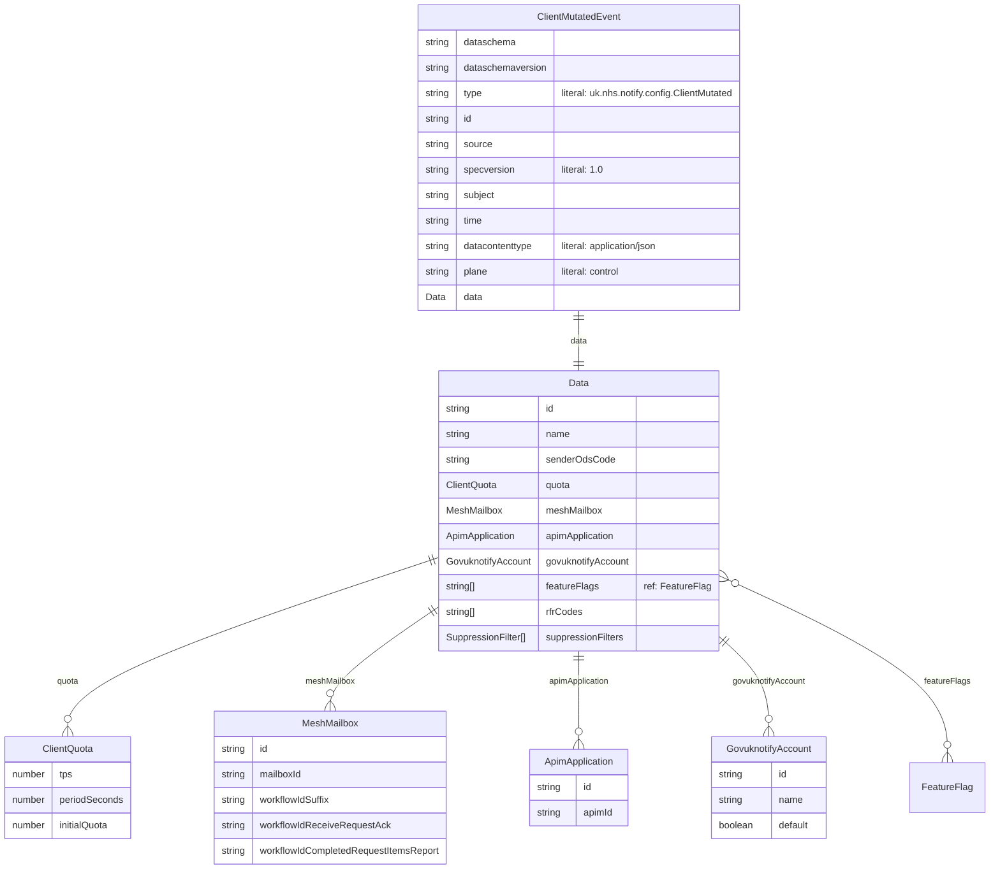

# client-mutated-1.0.0 event schema

```mermaid
erDiagram
    ClientMutatedEvent {
        string dataschema
        string dataschemaversion
        string type "literal: uk.nhs.notify.config.ClientMutated"
        string id
        string source
        string specversion "literal: 1.0"
        string subject
        string time
        string datacontenttype "literal: application/json"
        string plane "literal: control"
        Data data
    }
    Data {
        string id
        string name
        string senderOdsCode
        ClientQuota quota
        MeshMailbox meshMailbox
        ApimApplication apimApplication
        GovuknotifyAccount govuknotifyAccount
        string[] featureFlags "ref: FeatureFlag"
        string[] rfrCodes
        SuppressionFilter[] suppressionFilters
    }
    ClientQuota {
        number tps
        number periodSeconds
        number initialQuota
    }
    MeshMailbox {
        string id
        string mailboxId
        string workflowIdSuffix
        string workflowIdReceiveRequestAck
        string workflowIdCompletedRequestItemsReport
    }
    ApimApplication {
        string id
        string apimId
    }
    GovuknotifyAccount {
        string id
        string name
        boolean default
    }
    FeatureFlag {
    }
    ClientMutatedEvent ||--|| Data : "data"
    Data ||--o{ ClientQuota : "quota"
    Data ||--o{ MeshMailbox : "meshMailbox"
    Data ||--o{ ApimApplication : "apimApplication"
    Data ||--o{ GovuknotifyAccount : "govuknotifyAccount"
    Data }o--o{ FeatureFlag : "featureFlags"
```
